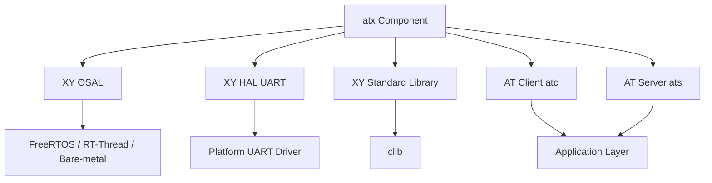

# XY ATX Component Implementation Plan

## Executive Summary

This plan outlines the implementation of the **atx** component, a comprehensive AT Command framework for the XinYi embedded platform. The component includes both AT Client and AT Server implementations with a unified build system.

**Version:** 1.0.0
**Date:** 2026-02-09
**Status:** Ready for Implementation

---

## 1. Component Overview

### 1.1 Purpose

The atx component provides:
- **AT Client (ATC)**: Send AT commands to external devices (modems, WiFi modules, etc.)
- **AT Server (ATS)**: Process incoming AT commands and respond appropriately
- **Unified Interface**: Common definitions and utilities for both client and server
- **Cross-Platform Support**: Uses XY OSAL for portability across RTOSes

### 1.2 Key Features

#### AT Client Features
- Asynchronous command execution with timeout support
- Response parsing with line-based access
- URC (Unsolicited Result Code) handling
- Data mode (transparent transmission)
- Multi-client support
- Thread-safe operation
- Retry mechanism

#### AT Server Features
- Command registration and dispatch
- Multiple command modes (Test, Query, Setup, Execute)
- Parameter parsing utilities
- Echo mode support
- Response formatting helpers
- Thread-safe operation

---

## 2. Architecture Design

### 2.1 Directory Structure

```
components/net/at/atx/
├── at.h                          # Common AT definitions
├── at.h                       # Unified header (version, common macros)
├── Makefile                      # Build system (Make)
├── CMakeLists.txt                # Build system (CMake)
├── Kconfig                       # Configuration options
├── README.md                     # Component documentation
├── atc/                          # AT Client
│   ├── at_client.h           # Client header (existing)
│   ├── at_client.c           # Client implementation (NEW)
│   └── examples/
│       ├── example_basic.c      # Basic client usage
│       ├── example_urc.c        # URC handling example
│       └── example_data_mode.c  # Data mode example
├── ats/                          # AT Server
│   ├── at_server.h           # Server header (existing)
│   ├── at_server.c           # Server implementation (NEW)
│   └── examples/
│       ├── example_basic.c      # Basic server usage
│       └── example_commands.c   # Command registration example
└── doc/
    ├── porting.md               # Porting guide
    ├── api_reference.md         # API documentation
    └── integration_guide.md     # Integration guide
```

### 2.2 Component Dependencies



### 2.3 Threading Model

#### AT Client Threading
```
┌─────────────────┐
│ Application     │
│ Thread          │
└────────┬────────┘
         │ at_exec_cmd()
         ▼
┌─────────────────┐     ┌──────────────┐
│ Command Send    │────▶│ UART TX      │
│ (Blocking)      │     └──────────────┘
└────────┬────────┘
         │ Wait on semaphore
         ▼
┌─────────────────┐     ┌──────────────┐
│ Parser Thread   │◀────│ UART RX      │
│ (Background)    │     └──────────────┘
└────────┬────────┘
         │
         ├─▶ Response Processing
         └─▶ URC Handling
```

#### AT Server Threading
```
┌─────────────────┐     ┌──────────────┐
│ Parser Thread   │◀────│ UART RX      │
│ (Background)    │     └──────────────┘
└────────┬────────┘
         │
         ▼
┌─────────────────┐
│ Command Parser  │
└────────┬────────┘
         │
         ▼
┌─────────────────┐
│ Command         │
│ Dispatcher      │
└────────┬────────┘
         │
         ▼
┌─────────────────┐     ┌──────────────┐
│ Handler         │────▶│ UART TX      │
│ Functions       │     └──────────────┘
└─────────────────┘
```

---

## 3. Implementation Details

### 3.1 AT Client Implementation ([`at_client.c`](components/net/at/atx/atc/at_client.c))

#### Core Functions

1. **Client Management**
   - `at_client_create()` - Allocate and initialize client
   - `at_client_init()` - Initialize static client
   - `at_client_delete()` - Clean up and free resources
   - `at_client_set_hal()` - Configure HAL interface

2. **Command Execution**
   - `at_exec_cmd()` - Execute AT command with response
   - `at_client_send()` - Send formatted command
   - `at_client_wait_resp()` - Wait for response with timeout

3. **Response Management**
   - `at_create_resp()` - Allocate response buffer
   - `at_delete_resp()` - Free response buffer
   - `at_resp_get_line()` - Get line by index
   - `at_resp_get_line_by_prefix()` - Find line by prefix
   - `at_resp_parse_line_args()` - Parse response arguments

4. **URC Handling**
   - `at_set_urc_table()` - Register URC handlers
   - `at_add_urc_handler()` - Add single URC handler
   - Internal: `_at_client_urc_match()` - Match URC prefix/suffix

5. **Parser Thread**
   - `_at_client_parser_thread()` - Main parser loop
   - `_at_client_recv_line()` - Receive line from UART
   - `_at_client_process_line()` - Process received line

6. **Data Mode**
   - `at_client_enter_data_mode()` - Enter transparent mode
   - `at_client_exit_data_mode()` - Exit transparent mode
   - `at_client_send_data()` - Send raw data
   - `at_client_recv_data()` - Receive raw data

#### Key Algorithms

**Line Reception Algorithm:**
```c
// Pseudo-code for line reception
while (not_full && not_timeout) {
    ch = get_char_from_uart(timeout);

    // Check for URC match
    if (urc_obj = match_urc_prefix(recv_buf)) {
        call_urc_handler(urc_obj);
        clear_buffer();
        continue;
    }

    // Check for line ending
    if (ch == '\n' && prev_ch == '\r') {
        process_line(recv_buf);
        break;
    }

    // Check for custom end sign
    if (end_sign != 0 && ch == end_sign) {
        process_line(recv_buf);
        break;
    }

    recv_buf[len++] = ch;
}
```

**Response Processing:**
```c
// Check for OK/ERROR/timeout
if (contains(line, "OK")) {
    resp_status = XY_AT_RESP_OK;
    signal_semaphore();
} else if (contains(line, "ERROR")) {
    resp_status = XY_AT_RESP_ERROR;
    signal_semaphore();
} else if (line_num > 0 && line_count >= line_num) {
    resp_status = XY_AT_RESP_OK;
    signal_semaphore();
}
```

### 3.2 AT Server Implementation ([`at_server.c`](components/net/at/atx/ats/at_server.c))

#### Core Functions

1. **Server Management**
   - `at_server_create()` - Allocate and initialize server
   - `at_server_init()` - Initialize static server
   - `at_server_delete()` - Clean up and free resources
   - `at_server_set_hal()` - Configure HAL interface
   - `at_server_start()` - Start parser thread
   - `at_server_stop()` - Stop parser thread

2. **Command Registration**
   - `at_server_register_cmd()` - Register command handler
   - `at_server_unregister_cmd()` - Unregister command
   - Internal: `_at_server_find_cmd()` - Find command by name

3. **Response Functions**
   - `at_server_printf()` - Send formatted response
   - `at_server_printfln()` - Send response with newline
   - `at_server_print_result()` - Send OK/ERROR
   - `at_server_send()` - Send raw data
   - `at_server_recv()` - Receive data with timeout

4. **Parameter Parsing**
   - `at_parse_args()` - Parse command arguments
   - `at_parse_int()` - Parse integer parameter
   - `at_parse_string()` - Parse string parameter
   - `at_parse_hex()` - Parse hexadecimal parameter

5. **Parser Thread**
   - `_at_server_parser_thread()` - Main parser loop
   - `_at_server_recv_line()` - Receive command line
   - `_at_server_parse_cmd()` - Parse command format
   - `_at_server_dispatch_cmd()` - Dispatch to handler

#### Command Parsing Algorithm

```c
// Parse AT command format
// AT+CMD=?      -> Test mode
// AT+CMD?       -> Query mode
// AT+CMD=<args> -> Setup mode
// AT+CMD        -> Execute mode

if (starts_with(line, "AT")) {
    cmd_start = line + 2;

    if (ends_with(cmd_start, "=?")) {
        mode = XY_AT_CMD_MODE_TEST;
        cmd_name = extract_name(cmd_start, len - 2);
    } else if (ends_with(cmd_start, "?")) {
        mode = XY_AT_CMD_MODE_QUERY;
        cmd_name = extract_name(cmd_start, len - 1);
    } else if (contains(cmd_start, "=")) {
        mode = XY_AT_CMD_MODE_SETUP;
        split_name_and_args(cmd_start, &cmd_name, &args);
    } else {
        mode = XY_AT_CMD_MODE_EXEC;
        cmd_name = cmd_start;
    }

    cmd = find_command(cmd_name);
    if (cmd && cmd->handlers[mode]) {
        result = cmd->handlers[mode](args);
        send_result(result);
    } else {
        send_error();
    }
}
```

---

## 4. Build System

### 4.1 Makefile Structure

```makefile
# Component name
COMPONENT = atx

# Source files
SRCS = atc/at_client.c \
       ats/at_server.c

# Include directories
INCLUDES = -I. -Iatc -Iats \
           -I../../kernel/osal \
           -I../../clib/clib

# Dependencies
DEPS = osal clib

# Build targets
all: library examples

library: libatx.a

examples: atc_examples ats_examples
```

### 4.2 CMakeLists.txt Structure

```cmake
cmake_minimum_required(VERSION 3.10)
project(atx VERSION 1.0.0 LANGUAGES C)

# Source files
set(ATC_SOURCES atc/at_client.c)
set(ATS_SOURCES ats/at_server.c)

# Include directories
include_directories(. atc ats)

# Create libraries
add_library(at_client STATIC ${ATC_SOURCES})
add_library(at_server STATIC ${ATS_SOURCES})
add_library(atx STATIC ${ATC_SOURCES} ${ATS_SOURCES})

# Link dependencies
target_link_libraries(atx osal clib)

# Examples
add_subdirectory(atc/examples)
add_subdirectory(ats/examples)
```

### 4.3 Kconfig Options

```kconfig
menuconfig XY_ATX
    bool "Enable XY AT Command Framework"
    default y
    help
      Enable AT Command Client and Server framework

if XY_ATX

config XY_AT_CLIENT
    bool "Enable AT Client"
    default y

config XY_AT_SERVER
    bool "Enable AT Server"
    default y

config XY_AT_CLIENT_NUM_MAX
    int "Maximum number of AT clients"
    default 1
    range 1 8

config XY_AT_CMD_MAX_LEN
    int "Maximum AT command length"
    default 256

config XY_AT_RESP_MAX_LEN
    int "Maximum response buffer length"
    default 1024

config XY_AT_URC_TABLE_MAX
    int "Maximum URC handlers"
    default 16

config XY_AT_SERVER_CMD_TABLE_MAX
    int "Maximum server commands"
    default 32

endif # XY_ATX
```

---

## 5. Example Files

### 5.1 AT Client Examples

#### Basic Client Example ([`atc/examples/example_basic.c`](components/net/at/atx/atc/examples/example_basic.c))

```c
// Basic AT command execution
at_client_t *client = at_client_create("modem", 256, 256);
at_client_set_hal(client, uart_get_char, uart_send, uart_recv);

at_response_t *resp = at_create_resp(512, 0, 5000);
at_exec_cmd(client, resp, "AT");
at_exec_cmd(client, resp, "AT+CGMI");

const char *line = at_resp_get_line(resp, 0);
printf("Manufacturer: %s\n", line);

at_delete_resp(resp);
at_client_delete(client);
```

#### URC Handling Example ([`atc/examples/example_urc.c`](components/net/at/atx/atc/examples/example_urc.c))

```c
// URC handler for network registration
void urc_creg_handler(at_client_t *client, const char *data, size_t size) {
    int n, stat;
    at_resp_parse_line_args(data, "+CREG: %d,%d", &n, &stat);
    printf("Network status: %d\n", stat);
}

// Register URC handlers
const at_urc_t urc_table[] = {
    {"+CREG:", NULL, urc_creg_handler},
    {"+CEREG:", NULL, urc_cereg_handler},
};

at_set_urc_table(client, urc_table, 2);
```

### 5.2 AT Server Examples

#### Basic Server Example ([`ats/examples/example_basic.c`](components/net/at/atx/ats/examples/example_basic.c))

```c
// Create and start AT server
at_server_t *server = at_server_create("uart_server");
at_server_set_hal(server, uart_get_char, uart_send);

// Register basic commands
at_server_register_cmd(server, &cmd_at);
at_server_register_cmd(server, &cmd_ate);
at_server_register_cmd(server, &cmd_ati);

at_server_start(server);
```

#### Command Registration Example ([`ats/examples/example_commands.c`](components/net/at/atx/ats/examples/example_commands.c))

```c
// AT+LED command implementation
at_result_t cmd_led_test(void) {
    at_server_printfln(server, "+LED: (0,1)");
    return XY_AT_RESULT_OK;
}

at_result_t cmd_led_query(void) {
    at_server_printfln(server, "+LED: %d", led_state);
    return XY_AT_RESULT_OK;
}

at_result_t cmd_led_setup(const char *args) {
    int state;
    if (at_parse_int(args, &state) == 0) {
        set_led(state);
        return XY_AT_RESULT_OK;
    }
    return XY_AT_RESULT_PARSE_ERR;
}

// Register command
const at_cmd_t cmd_led = {
    .name = "AT+LED",
    .test = cmd_led_test,
    .query = cmd_led_query,
    .setup = cmd_led_setup,
    .exec = NULL,
};
```

---

## 6. Implementation Checklist

### Phase 1: Core Implementation
- [ ] Implement [`at_client.c`](components/net/at/atx/atc/at_client.c) with all client functions
- [ ] Implement [`at_server.c`](components/net/at/atx/ats/at_server.c) with all server functions
- [ ] Add proper error handling and validation
- [ ] Add debug logging support

### Phase 2: Build System
- [ ] Create [`Makefile`](components/net/at/atx/Makefile) for Make-based builds
- [ ] Create [`CMakeLists.txt`](components/net/at/atx/CMakeLists.txt) for CMake builds
- [ ] Create [`Kconfig`](components/net/at/atx/Kconfig) for configuration
- [ ] Test build on multiple platforms

### Phase 3: Examples and Tests
- [ ] Create AT Client basic example
- [ ] Create AT Client URC example
- [ ] Create AT Client data mode example
- [ ] Create AT Server basic example
- [ ] Create AT Server command registration example
- [ ] Add unit tests (optional)

### Phase 4: Documentation
- [ ] Update main [`README.md`](components/net/at/atx/README.md)
- [ ] Create API reference documentation
- [ ] Create porting guide
- [ ] Create integration guide
- [ ] Add inline code documentation

---

## 7. Key Design Decisions

### 7.1 Memory Management
- **Dynamic allocation** for `at_client_create()` and `at_server_create()`
- **Static initialization** supported via `at_client_init()` and `at_server_init()`
- User-provided buffers for responses to avoid fragmentation

### 7.2 Thread Safety
- Mutex protection for client command execution
- Semaphore-based response notification
- Parser thread runs independently
- No global state (all state in client/server structures)

### 7.3 Portability
- Uses XY OSAL for all OS primitives
- HAL interface for UART access
- No platform-specific code in core implementation
- Configurable via Kconfig/defines

### 7.4 Error Handling
- Return status codes for all functions
- Timeout support for blocking operations
- Graceful degradation on errors
- Statistics tracking for debugging

---

## 8. Testing Strategy

### 8.1 Unit Testing
- Test individual functions in isolation
- Mock HAL interfaces
- Test error conditions
- Test boundary conditions

### 8.2 Integration Testing
- Test with real UART hardware
- Test with AT modem/device
- Test multi-threaded scenarios
- Test URC handling under load

### 8.3 Platform Testing
- Test on FreeRTOS
- Test on RT-Thread
- Test on bare-metal (if supported)
- Test on different MCU architectures

---

## 9. Performance Considerations

### 9.1 Memory Usage
- Client: ~1.5 KB RAM (default config)
- Server: ~1.0 KB RAM (default config)
- Response buffers: Configurable
- Stack usage: ~1 KB per parser thread

### 9.2 CPU Usage
- Parser thread: Low priority, event-driven
- Command execution: Blocking, minimal CPU
- URC handling: Callback-based, fast

### 9.3 Throughput
- Command rate: Up to 100 commands/sec
- Data mode: Limited by UART speed
- Response time: < 10ms typical

---

## 10. Future Enhancements

### 10.1 Short-term
- Add support for binary data in responses
- Add command history/logging
- Add performance profiling hooks
- Add more example devices

### 10.2 Long-term
- Add AT command scripting support
- Add automatic retry with backoff
- Add connection pooling for multiple devices
- Add AT command recording/playback for testing

---

## 11. References

### 11.1 Standards
- ITU-T V.250: AT Command Set for DCE
- 3GPP TS 27.007: AT command set for User Equipment (UE)
- 3GPP TS 27.005: AT commands for SMS

### 11.2 Existing Implementations
- RT-Thread AT component
- FreeRTOS Cellular Interface
- AT-Command-V2 framework
- SIMCOM AT command reference

### 11.3 Project Files
- [`at_client.h`](components/net/at/atx/atc/at_client.h) - Client header
- [`at_server.h`](components/net/at/atx/ats/at_server.h) - Server header
- [`at.h`](components/net/at/atx/at.h) - Common definitions
- [`at.h`](components/net/at/atx/at.h) - Base definitions
- [`Readme.md`](components/net/at/atx/Readme.md) - Component overview
- [`atc-code-ref.md`](components/net/at/atx/atc-code-ref.md) - Implementation reference

---

## 12. Implementation Timeline

### Week 1: Core Implementation
- Day 1-2: AT Client core functions
- Day 3-4: AT Client parser thread and URC handling
- Day 5: AT Client data mode

### Week 2: Server and Build System
- Day 1-2: AT Server core functions
- Day 3: AT Server parser and dispatcher
- Day 4: Build system (Makefile, CMake, Kconfig)
- Day 5: Integration testing

### Week 3: Examples and Documentation
- Day 1-2: Create all example files
- Day 3-4: Write documentation
- Day 5: Final testing and review

---

## Conclusion

This plan provides a comprehensive roadmap for implementing the atx component. The design emphasizes:

1. **Modularity**: Separate client and server implementations
2. **Portability**: XY OSAL abstraction for cross-platform support
3. **Flexibility**: Configurable via Kconfig, supports multiple use cases
4. **Robustness**: Thread-safe, error handling, timeout support
5. **Usability**: Clear API, examples, documentation

The implementation follows XinYi project coding standards and integrates seamlessly with the existing component ecosystem.
